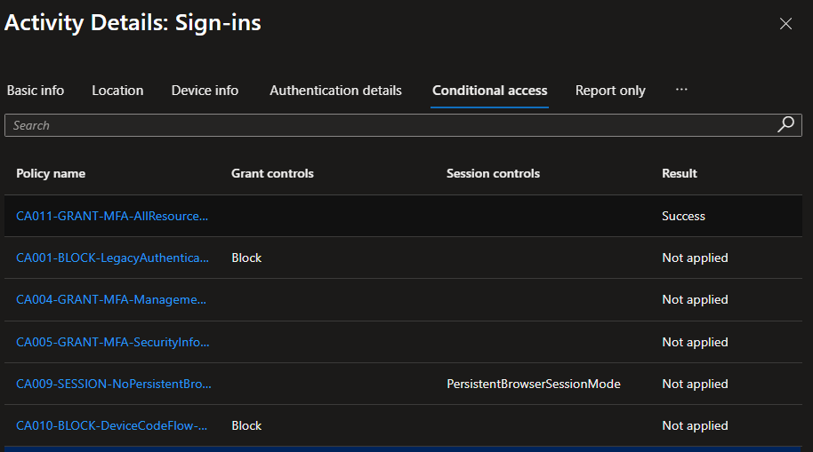
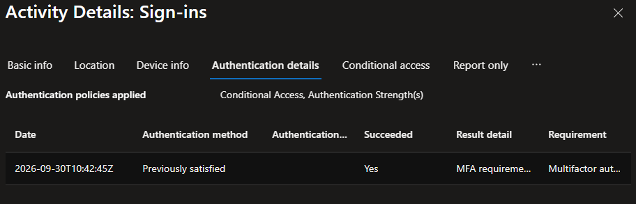
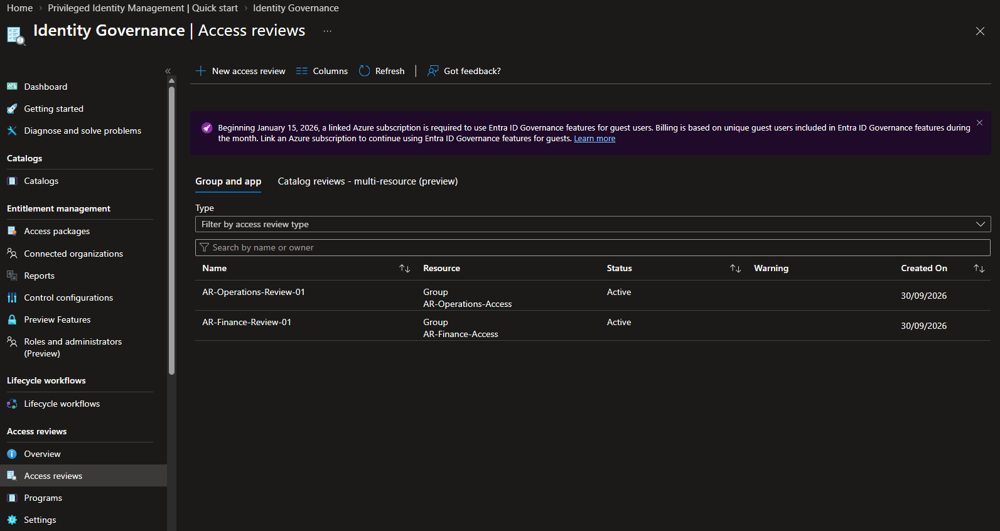
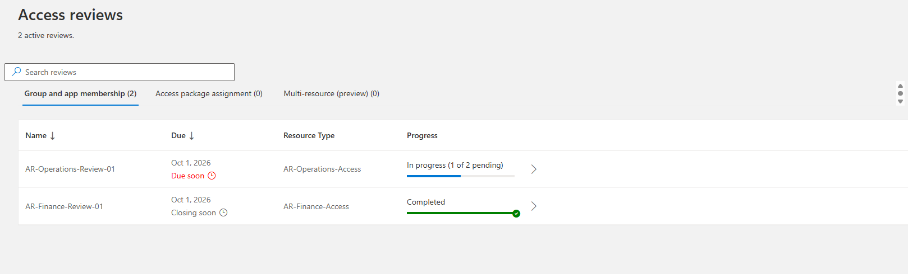
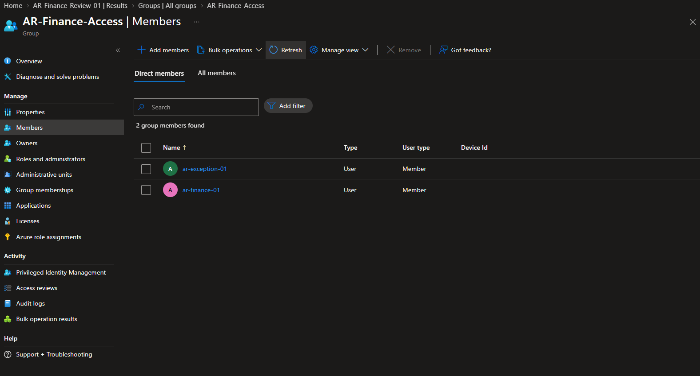
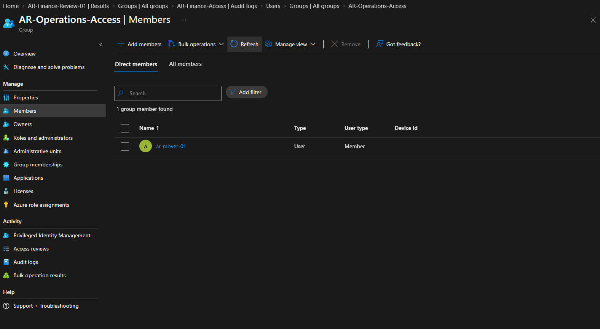
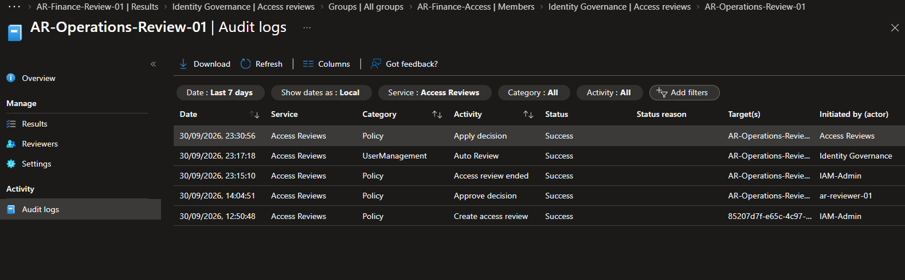

# Microsoft Entra Identity Governance: Access Reviews & Recertification

## Implementation status

**Status: M1–M5 complete for the revised controlled laboratory scope.** Native Finance and Operations remediation, nonresponse handling, recovery, and authorized early exception closure were verified. The final Graph check on 1 October 2026 at 00:04:44 BST matched Finance 1, Operations 1 and Control 2; the leaver remained disabled and the reviewer outside all three groups.

Both reviews were ended early. Scheduled closure was not exercised; EXC-001 was removed manually before its original expiry. These limits and the authorized execution changes remain explicit in the [final acceptance record](docs/m05-final-acceptance.md).

This controlled synthetic implementation follows group membership from baseline inventory through business attestation to verified remediation. Completion applies only to the documented laboratory scope; no production deployment or application-access revocation is claimed.

## Executive overview

| Area | Current state |
| --- | --- |
| Business problem | Group memberships can persist after transfers or departure, while temporary access can remain beyond its business purpose |
| Platform | Microsoft Entra ID access reviews with participant P2 assignments |
| Controlled population | Five cloud Member accounts and three assigned security groups |
| Reviewed resources | AR-Finance-Access and AR-Operations-Access |
| Control resource | AR-Control-Access remains outside review scope |
| Administration and attestation | IAM-Admin configures reviews; ar-reviewer-01 makes decisions without a directory role |
| Reviewer authentication | Scoped CA011 policy succeeded; MFA was satisfied through a prior authentication claim |
| Decision state | Finance: two approved, two denied; Operations: one approved, one platform denial after nonresponse |
| Exception | EXC-001 closed early by IAM-Admin on 1 October 2026 at 00:01:46 BST; original approval and expiry preserved |
| Outcome boundary | Native removals, recovery, manual exception closure and final object-ID membership comparison verified |

## Business scenario and objective

A Finance employee requires continued access. A mover has transferred to Operations but retains obsolete Finance membership. A disabled leaver still belongs to both departments. A handover account requires a documented, bounded exception. A separate control group establishes whether remediation stays within its intended scope.

The implementation must demonstrate justified retention, obsolete-access removal, nonresponse handling, exception ownership and expiry, and controlled recovery. Each outcome requires both a review result and an independent membership check. The detailed [scope and acceptance criteria](docs/m01-scope-and-acceptance.md) define the completion boundary.

## Architecture and control flow

Finance and Operations have separate one-time reviews. Their decisions feed native result application, followed by independent member-set comparison. Control-group membership is compared before and after but never enters review scope. Manual exception closure and recovery occur after native outcome evidence is preserved.

The [access review architecture and lifecycle](architecture/access-review-lifecycle.md) documents the control flow and responsibilities. The reviewed groups have direct assigned user membership, are cloud-created and non-role-assignable, and have no application assignments. Hybrid groups, privileged-role assignments and unrelated identities remain outside membership remediation.

## Engineering scope

- Resource scoping, participant licensing and baseline membership validation.
- Separation of review administration and business attestation.
- Reviewer MFA enforcement and sign-in evidence interpretation.
- One-time group reviews, required justifications and automatic result application.
- Deliberate nonresponse, owner-authorized manual exception closure and an excluded control group.
- Independent membership comparison, audit reconciliation and controlled recovery.
- Milestone evidence, operational ownership and final acceptance criteria.

## Delivery roadmap

| Milestone | Engineering outcome | Current status |
| --- | --- | --- |
| M1 — Foundation | Establish licensing, delegation baseline, resource boundaries and acceptance criteria | Complete |
| M2 — Baseline and design | Create participants and groups; verify baseline memberships; define review decisions and outcome tests | Complete |
| M3 — Configuration and execution | Configure reviewer authentication and reviews; record justified decisions | Complete; five explicit decisions and one subsequent platform denial |
| M4 — Remediation and exceptions | Validate native application, exact memberships, exception removal and recovery | Complete within revised scope; early manual exception closure verified |
| M5 — Operational handover | Reconcile final outcomes, document ownership and complete assurance | Complete; retained limitations and operating guidance documented |

## Milestone 1: foundation and review readiness

The initial group-and-app review inventory was empty. Group-owner review management was set to No. The foundation established a controlled administrative boundary and separated discovery from subsequent review execution.

| Evidence | Demonstrates |
| --- | --- |
| [Delegation baseline](screenshots/m01-01-access-review-delegation-baseline.png) | Group-owner review management set to No |
| [Review inventory baseline](screenshots/m01-02-access-review-inventory-baseline.png) | No existing group-and-app reviews displayed |

See the [foundation baseline](docs/m01-foundation-baseline.md).

## Milestone 2: identity and entitlement baseline

Five dedicated accounts received direct P2 assignments. IAM-Admin owns the three project groups. The reviewer has no membership in those groups, and the leaver account is disabled.

| Account | AR-Finance-Access | AR-Operations-Access | AR-Control-Access |
| --- | --- | --- | --- |
| ar-reviewer-01 | No | No | No |
| ar-finance-01 | Yes | No | Yes |
| ar-mover-01 | Yes | Yes | Yes |
| ar-leaver-01 | Yes | Yes | No |
| ar-exception-01 | Yes | No | No |
| Total direct members | 4 | 2 | 2 |

The [baseline record](docs/m02-identity-and-entitlement-baseline.md), [review design](docs/m02-review-design.md) and [validation plan](docs/m02-validation-plan.md) define the inputs and expected outcomes. Object-ID resolution and fresh Graph membership checks passed before review creation.

| Evidence | Demonstrates |
| --- | --- |
| [Finance baseline](screenshots/m02-01-finance-membership-baseline.png) | Four initial direct members |
| [Operations baseline](screenshots/m02-02-operations-membership-baseline.png) | Two initial direct members |
| [Control baseline](screenshots/m02-03-control-membership-baseline.png) | Two members outside review scope |

## Milestone 3: review configuration and decisions

Both reviews use ar-reviewer-01 and cover everyone in their selected group. Their portal dates are 30 September–1 October 2026. Auto-apply results is enabled and unanswered reviews use Remove access. These were the configured dates; both instances were subsequently ended early during M4.

| Review | Account | Recorded decision |
| --- | --- | --- |
| AR-Finance-Review-01 | ar-finance-01 | Approved for current Finance responsibilities |
| AR-Finance-Review-01 | ar-mover-01 | Denied because Finance access is obsolete after transfer |
| AR-Finance-Review-01 | ar-leaver-01 | Denied to remove residual membership following departure |
| AR-Finance-Review-01 | ar-exception-01 | Approved under EXC-001 for temporary handover |
| AR-Operations-Review-01 | ar-mover-01 | Approved for current Operations responsibilities |
| AR-Operations-Review-01 | ar-leaver-01 | Initially unanswered; M4 platform denial and removal after early completion |

All five submitted justifications were inspected in My Access. The [decision record](docs/m03-decision-record.md) preserves their text. At the M3 observation point neither review had been stopped or applied. Both were subsequently stopped early in M4 and their results applied automatically.

### Reviewer authentication evidence

CA011-GRANT-MFA-AllResources-AccessReviewReviewer targets only ar-reviewer-01 across all resources and requires the Multifactor authentication strength. After report-only evaluation, the enabled policy recorded Success.

Authentication details showed Previously satisfied and a successful multifactor requirement. This establishes satisfaction through an existing claim, not a newly observed Authenticator challenge.

### Review execution evidence

The administrator inventory shows both reviews Active against their intended groups.

The reviewer view shows Finance decisions complete and one Operations decision pending. These are decision-progress observations, not post-remediation membership evidence.

See [M3 execution](docs/m03-review-execution.md) and [authentication and administration](docs/m03-authentication-and-administration.md) for configuration evidence and its limits.

## Milestone 4: remediation and controlled recovery

Finance native removals succeeded at 22:38:13 BST. IAM-Admin temporarily restored the mover at 23:01:57 and removed that membership at 23:03:39, with successful audit events and independent portal verification. Operations ended at 23:15:10; Auto Review succeeded at 23:17:18; Apply decision succeeded at 23:30:56.

| Group | Observed member set after remediation and recovery cleanup |
| --- | --- |
| AR-Finance-Access | ar-finance-01; ar-exception-01 |
| AR-Operations-Access | ar-mover-01 |
| AR-Control-Access | ar-finance-01; ar-mover-01, also matched by final Graph validation |

The original scheduled-deadline test was replaced during execution with early-completion nonresponse testing. This distinction is retained in the [M4 remediation record](docs/m04-remediation-results.md). See [recovery validation](docs/m04-recovery-validation.md) and [acceptance status](docs/m04-acceptance-status.md). EXC-001 was subsequently closed early on 1 October; the table above preserves the pre-closure state.

## Milestone 5: final acceptance and handover

The owner authorized early EXC-001 closure to complete the laboratory exercise. IAM-Admin removed the exception membership at 00:01:46 BST on 1 October; the audit showed Success. A fresh Graph check at 00:04:44 BST matched all expected current member sets and account states without tenant changes.

| Group | Final members | Count |
|---|---|---:|
| AR-Finance-Access | ar-finance-01 | 1 |
| AR-Operations-Access | ar-mover-01 | 1 |
| AR-Control-Access | ar-finance-01; ar-mover-01 | 2 |

See [exception closure](docs/m04-exception-closure.md), [final acceptance](docs/m05-final-acceptance.md), [operational handover](docs/m05-operational-handover.md), and [final membership data](data/m05-final-membership.csv). Earlier milestone evidence remains a chronological record; its member counts are not the final state.

## Security and engineering controls

| Control | Implementation or validation boundary |
| --- | --- |
| Scoped remediation | Only the two named departmental groups are reviewed |
| Independent attestation | Dedicated reviewer account has no directory role and no project-group membership |
| Business justification | Explicit decisions record retained need, transfer, departure or EXC-001 |
| Nonresponse | Operations leaver left unanswered; platform denial and successful removal verified after early completion |
| Exception ownership | IAM-Admin performed authorized early manual removal; final absence independently verified |
| Independent validation | Fresh membership reads must confirm outcomes separately from reviewer decisions |
| Recovery | Restore only an expressly authorized test membership after preserving native removal evidence |
| Evidence handling | Published evidence excludes complete tenant UPNs and authentication secrets |

## Microsoft guidance and implementation decisions

| Microsoft guidance | Application to this implementation | Remaining boundary |
| --- | --- | --- |
| [Plan an access reviews deployment](https://learn.microsoft.com/en-us/entra/id-governance/deploy-access-reviews) | Named resources, designated reviewer and a controlled review population | One-time laboratory reviews; recurring operational cadence belongs to handover |
| [Create group and application access reviews](https://learn.microsoft.com/en-us/entra/id-governance/create-access-review) | Explicit group scope, justification, nonresponse action and auto-apply settings | Remove access is a deliberate scenario choice, not a universal default recommendation |
| [Perform access reviews](https://learn.microsoft.com/en-us/entra/id-governance/perform-access-review) | Reviewer records business decisions and justifications in My Access | Email notification delivery is untested |
| [Complete access reviews](https://learn.microsoft.com/en-us/entra/id-governance/complete-access-review) | Distinguish review decisions, application status and resulting membership | Native application verified; scheduled-deadline closure was not exercised |
| [Access review FAQs](https://learn.microsoft.com/en-us/entra/id-governance/access-reviews-faqs) | Cloud groups with direct membership avoid the documented synced/nested membership removal constraints | No claim that this test validates those other membership models |

These references explain the design and supported behavior. They do not establish that every production recommendation has been implemented or that unobserved outcomes have passed.

## Operational ownership and final validation

| Activity | Responsible account | Trigger or deadline |
| --- | --- | --- |
| Business attestation | ar-reviewer-01 | Five explicit reviewer decisions; Operations nonresponse later resolved by the platform |
| Native application and member-set verification | IAM-Admin | Native processing after administrator early completion; final consolidated ID check passed |
| EXC-001 removal and verification | IAM-Admin | Completed early on 1 October 2026; original deadline retained in history |
| Controlled recovery | Authorized administrator | Completed for Finance mover after native removal evidence and explicit authorization |
| Final assurance and operational handover | IAM-Admin | Final verification passed on 1 October; operating guidance documented |

Final verified membership after exception closure is Finance: ar-finance-01; Operations: ar-mover-01; Control: ar-finance-01 and ar-mover-01. This was reached by authorized early manual removal, not by waiting for the original expiry. Repeat validation with `-ExceptionClosed` as described in the handover.

## Documentation map

| Area | Artifact |
| --- | --- |
| Architecture | [Access review lifecycle](architecture/access-review-lifecycle.md) |
| Foundation | [M1 baseline](docs/m01-foundation-baseline.md) |
| Acceptance | [Scope and acceptance criteria](docs/m01-scope-and-acceptance.md) |
| Participants | [M2 identity and entitlement baseline](docs/m02-identity-and-entitlement-baseline.md) |
| Review design | [M2 review design](docs/m02-review-design.md) |
| Tests | [Validation plan](docs/m02-validation-plan.md) |
| Baseline data | [Membership baseline](data/m02-membership-baseline.csv) |
| Outcome targets | [Expected outcomes](data/m02-expected-outcomes.csv) |
| Execution | [M3 review execution](docs/m03-review-execution.md) |
| Authentication and PIM changes | [M3 authentication and administration](docs/m03-authentication-and-administration.md) |
| Decisions | [M3 decision record](docs/m03-decision-record.md) |
| Policy | [Access review policy](policies/access-review-policy.md) |
| Exception procedure | [Exception handling](runbooks/exception-handling.md) |
| Recovery procedure | [Recovery design](runbooks/recovery-design.md) |
| M4 remediation | [Native results](docs/m04-remediation-results.md) |
| M4 recovery | [Recovery validation](docs/m04-recovery-validation.md) |
| M4 acceptance | [Acceptance status](docs/m04-acceptance-status.md) |
| Final membership validation | [Read-only Graph script](scripts/Test-ARMembership.ps1) |
| M4 exception closure | [Closure record](docs/m04-exception-closure.md) |
| M5 acceptance | [Final acceptance](docs/m05-final-acceptance.md) |
| M5 handover | [Operational handover](docs/m05-operational-handover.md) |
| Final membership data | [Member sets](data/m05-final-membership.csv) |
| Evidence | [Evidence register](docs/evidence-register.md) |

## Technical documentation structure

| Path | Purpose |
| --- | --- |
| `architecture/` | Scope, responsibilities and review lifecycle |
| `data/` | Membership baseline and expected outcome tables |
| `docs/` | Milestone implementation, decision and validation records |
| `policies/` | Access-review control requirements |
| `runbooks/` | Repeatable exception and recovery procedures |
| `screenshots/` | Numbered technical evidence |
| `scripts/` | Read-only validation |

## Limitations and production improvements

- Native application, nonresponse removal, recovery and early manual exception closure were verified. Final object-ID comparisons passed. Scheduled closure and original-deadline exception enforcement were not tested.
- Both reviews were ended early. Operations end and application audit times were retained; the exact Finance stop time was not. Scheduled closure was not tested.
- Finance's full creation summary was inspected. Operations' scope, dates and completion settings were inspected, but its full settings summary has not been retained.
- The lab uses one-day, one-time reviews. Production scheduling must reflect business ownership, resource risk and representative review windows.
- EXC-001 was manually removed early. No native expiring membership or automated scheduler was configured.
- IAM-Admin used Global Administrator. The PIM maximum was changed to 24 hours and a 24-hour activation was confirmed; this is a documented lab choice, not a least-privileged production recommendation. Narrower supported administrative roles and shorter task-bound activation should be evaluated for production.
- The role-policy change affects eligible Global Administrator activations; exact activation timestamps and a complete post-change policy export were not captured. Earlier PIM project records remain historical baselines.
- Participant P2 assignments were confirmed. The observed trial expiry is 6 October 2026; the documented premium operations completed on 1 October. Future premium work requires licence continuity.
- These groups have no application assignments. Membership remediation does not demonstrate session termination or downstream application-access revocation.

## Authoritative Microsoft references

- [Access reviews overview](https://learn.microsoft.com/en-us/entra/id-governance/access-reviews-overview)
- [Plan an access reviews deployment](https://learn.microsoft.com/en-us/entra/id-governance/deploy-access-reviews)
- [Create access reviews](https://learn.microsoft.com/en-us/entra/id-governance/create-access-review)
- [Perform access reviews](https://learn.microsoft.com/en-us/entra/id-governance/perform-access-review)
- [Complete access reviews](https://learn.microsoft.com/en-us/entra/id-governance/complete-access-review)
- [Access review FAQs](https://learn.microsoft.com/en-us/entra/id-governance/access-reviews-faqs)
- [Microsoft Entra role best practices](https://learn.microsoft.com/en-us/entra/identity/role-based-access-control/best-practices)
- [Configure Microsoft Entra role settings in PIM](https://learn.microsoft.com/en-us/entra/id-governance/privileged-identity-management/pim-how-to-change-default-settings)
- [Microsoft Entra ID Governance licensing fundamentals](https://learn.microsoft.com/en-us/entra/id-governance/licensing-fundamentals)
