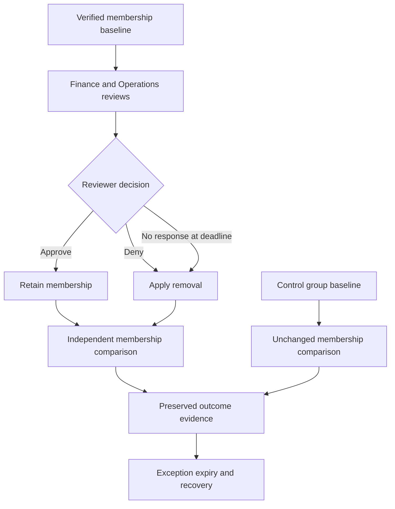

# Access review architecture and lifecycle

## Components

| Component | Responsibility | Boundary |
|---|---|---|
| IAM-Admin | Configure reviews, maintain groups and execute authorized manual follow-up | Existing PIM-controlled administration |
| ar-reviewer-01 | Review business need in My Access | No directory role; no membership in reviewed groups |
| AR-Finance-Access | Retention, obsolete membership and EXC-001 | Four baseline direct members |
| AR-Operations-Access | Justified membership and non-response fallback | Two baseline direct members |
| AR-Control-Access | Unchanged membership control | Two members; excluded from reviews |
| P2 assignments | Entitle the five participants | Direct user assignments, independent of reviewed groups |

## Review and validation flow

M2 established the groups and design. M3 recorded five explicit decisions and one deliberate nonresponse. M4 ended both reviews early, observed native application, and verified the Finance recovery test. The diagram describes the original scheduled path; the executed nonresponse path used early completion. Control never enters review scope. Exception expiry remains a separate manual action. These groups have no application assignments, so downstream application access and session revocation are not validated.

See [M4 remediation](../docs/m04-remediation-results.md) and [acceptance status](../docs/m04-acceptance-status.md).
