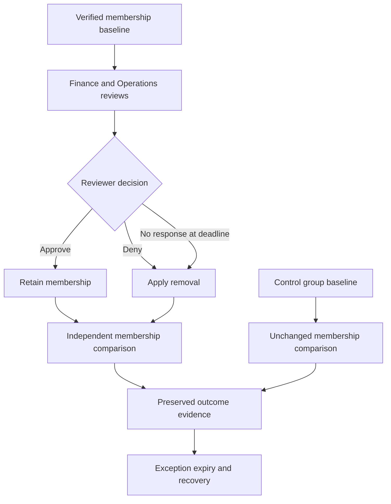

# Access review architecture and lifecycle

## Components
| Component | Responsibility | Boundary |
|---|---|---|
| IAM-Admin | Configure reviews, maintain groups and execute authorized manual follow-up | Existing PIM-controlled administration |
| ar-reviewer-01 | Review business need in My Access | No directory role; no membership in reviewed groups |
| AR-Finance-Access | Retention, obsolete membership and EXC-001 | Four baseline direct members |
| AR-Operations-Access | Justified membership and non-response fallback | Two baseline direct members |
| AR-Control-Access | Unchanged membership control | Two members; excluded from reviews |
| P2 assignments | Entitle the five participants | Direct user assignments, independent of reviewed groups |

## Review and validation flow

This is the intended process. M2 establishes the groups and design; reviews, automatic application and manual follow-up remain unexecuted. The control group never enters the review scope. EXC-001 expiry and recovery cleanup are separate manual actions. None of these groups is assigned to an application, and no application-access revocation is asserted.
