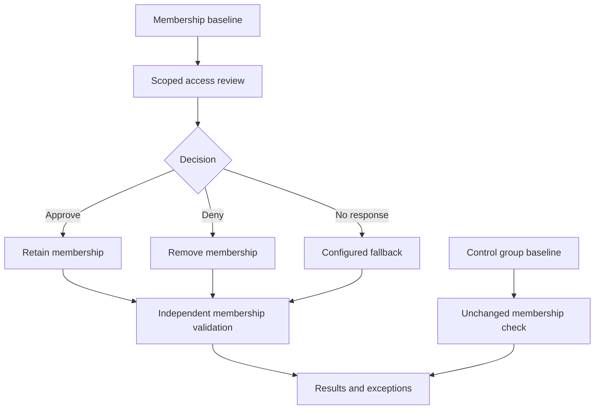

# Access review lifecycle

This diagram describes the planned process. It does not represent completed execution. The control group is excluded from reviews; its membership is compared independently. Exception expiry and follow-up are managed through a documented process.
