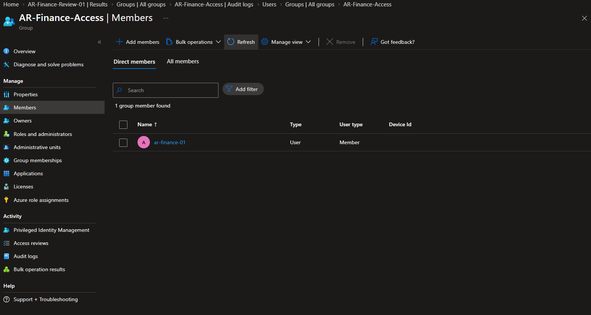

# M4 - Exception closure

## Authorization and execution

EXC-001 originally retained ar-exception-01 in AR-Finance-Access for a synthetic handover until 3 October 2026, 18:00 Europe/London (17:00 UTC). On 1 October the owner authorized early closure to complete the laboratory exercise. This supersedes the remaining duration, not the historical approval or its original justification.

| Event | Observed result |
|---|---|
| Manual removal | 1 October 2026, 00:01:46 BST / 30 September 2026, 23:01:46 UTC |
| Activity | Remove member from group |
| Status and actor | Success; IAM-Admin |
| Target | ar-exception-01; confirmed by the operator in the audit target details |
| Portal membership | AR-Finance-Access contains only ar-finance-01 |
| Independent check | 2026-09-30T23:04:44.4198211Z; all three expected object-ID member sets matched |

The audit activity screenshot was inspected for time, status and actor but is not retained in the repository because it includes account, session and network details. The target identification is operator-confirmed. The clean member-list evidence is retained below.

## Result and boundary

The exception is closed. The removal was manual and explicitly authorized before the original expiry. It does not demonstrate automatic expiration, scheduled removal, or independent completion of a real business handover. No account deletion, licence removal or unrelated group modification was part of this action.

The subsequent [final acceptance](m05-final-acceptance.md) records the complete observed member sets and account-state checks. The [exception runbook](../runbooks/exception-handling.md) preserves the original approval and repeatable procedure.
